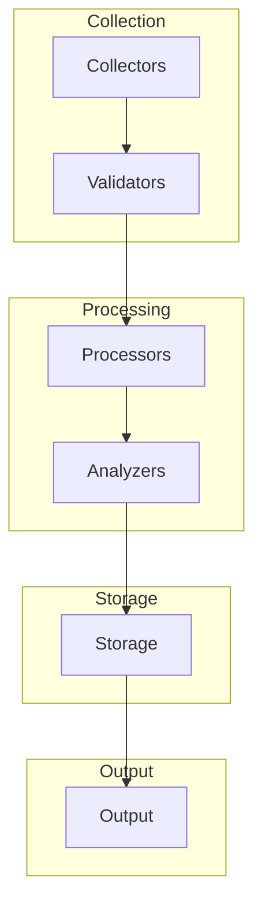

# Complete Data Lifecycle Documentation

## Overview
The Diagnostics Service implements a comprehensive data lifecycle management system that processes metrics from collection to visualization through multiple specialized layers. Each layer is designed for specific functionality and optimized for its particular role in the data pipeline.

## Layer Architecture

### 1. Data Collection Layer 🟣
The entry point for all metrics in the system.

#### Components
- **System Metrics Collector**
  - CPU utilization
  - Memory usage
  - Disk I/O
  - System load

- **Application Metrics Collector**
  - Response times
  - Request rates
  - Error rates
  - Application state

- **Network Metrics Collector**
  - Bandwidth usage
  - Latency
  - Packet loss
  - Connection states

- **Custom Metrics Collector**
  - User-defined metrics
  - Business KPIs
  - Custom performance indicators

#### Implementation
```csharp
public interface IMetricCollector
{
    Task<MetricData> CollectMetricsAsync();
    bool SupportsMetricType(MetricType type);
    MetricCollectionConfiguration GetConfiguration();
}
```

### 2. Validation Layer 🔵
Ensures data quality and enriches metrics with additional context.

#### Components
- **Validation Service**
  - Data type validation
  - Range validation
  - Consistency checks
  - Schema validation

- **Enrichment Service**
  - Timestamp normalization
  - Tag addition
  - Context enrichment
  - Metadata augmentation

- **Filtering Service**
  - Noise reduction
  - Duplicate removal
  - Relevance filtering
  - Rate limiting

#### Implementation
```csharp
public interface IValidationPipeline
{
    Task<ValidationResult> ValidateAsync(MetricData data);
    Task<MetricData> EnrichAsync(MetricData data);
    Task<MetricData> FilterAsync(MetricData data);
}
```

### 3. Processing Layer 💗
Handles metric processing and preparation for analysis.

#### Components
- **Buffer Manager**
  - Input buffering
  - Batch processing
  - Flow control
  - Memory management

- **Sampling Service**
  - Adaptive sampling
  - Downsampling
  - Rate adjustment
  - Sample optimization

- **Aggregation Service**
  - Time-based aggregation
  - Statistical aggregation
  - Custom aggregations
  - Group operations

- **Transformation Service**
  - Data normalization
  - Format conversion
  - Unit conversion
  - Data compression

#### Implementation
```csharp
public interface IMetricProcessor
{
    Task BufferMetricAsync(MetricData data);
    Task<ProcessedData> ProcessBatchAsync(IEnumerable<MetricData> batch);
    Task<AggregatedData> AggregateAsync(ProcessedData data);
    Task<TransformedData> TransformAsync(AggregatedData data);
}
```

### 4. Analysis Pipeline 💚
Performs real-time and historical analysis of metrics.

#### Real-time Analysis
- **Anomaly Detection**
  - Statistical analysis
  - Pattern matching
  - Threshold monitoring
  - Trend detection

- **Trend Analysis**
  - Real-time trending
  - Slope calculation
  - Trend prediction
  - Change detection

- **Health Monitoring**
  - System health checks
  - Performance monitoring
  - Resource utilization
  - Health scoring

#### Historical Analysis
- **Pattern Recognition**
  - Historical patterns
  - Seasonality detection
  - Cycle identification
  - Pattern matching

- **Forecasting**
  - Time series forecasting
  - Predictive analytics
  - Capacity planning
  - Trend extrapolation

- **Correlation Analysis**
  - Metric correlation
  - Causation analysis
  - Impact assessment
  - Relationship mapping

#### Implementation
```csharp
public interface IAnalysisPipeline
{
    Task<AnalysisResult> PerformRealTimeAnalysisAsync(MetricData data);
    Task<AnalysisResult> PerformHistoricalAnalysisAsync(
        IEnumerable<MetricData> historicalData);
    Task<CorrelationResult> AnalyzeCorrelationsAsync(
        IDictionary<string, MetricData> metrics);
}
```

### 5. Storage Layer 🟧
Manages persistent storage of metrics and analysis results.

#### Time Series Storage
- **Write Buffer**
  - Write optimization
  - Batch writing
  - Write-ahead logging
  - Buffer management

- **Read Cache**
  - Read optimization
  - Cache management
  - Query optimization
  - Cache invalidation

- **Disk Storage**
  - Data persistence
  - Compression
  - Indexing
  - Archival

#### Analytics Storage
- **Alert Store**
  - Alert history
  - Alert status
  - Alert correlation
  - Alert metadata

- **Baseline Store**
  - Normal patterns
  - Expected ranges
  - Historical baselines
  - Threshold history

- **Pattern Store**
  - Identified patterns
  - Pattern metadata
  - Pattern relationships
  - Pattern evolution

#### Implementation
```csharp
public interface IStorageManager
{
    Task<StorageResult> StoreMetricAsync(MetricData data);
    Task<StorageResult> StoreAnalysisResultAsync(AnalysisResult result);
    Task<QueryResult> QueryMetricsAsync(TimeRange range, QueryFilter filter);
    Task<MaintenanceResult> PerformMaintenanceAsync();
}
```

### 6. Output Layer 💛
Provides access to processed data and analysis results.

#### Alert Management
- **Alert Generator**
  - Alert creation
  - Alert classification
  - Priority assignment
  - Alert enrichment

- **Alert Processor**
  - Alert routing
  - Alert aggregation
  - Alert correlation
  - Alert lifecycle

- **Notification Service**
  - Notification dispatch
  - Channel management
  - Delivery tracking
  - Escalation handling

#### API Services
- **REST API**
  - CRUD operations
  - Query endpoints
  - Batch operations
  - API versioning

- **GraphQL API**
  - Flexible queries
  - Real-time subscriptions
  - Schema definition
  - Resolution optimization

- **WebSocket API**
  - Real-time updates
  - Streaming data
  - Bi-directional communication
  - Connection management

#### Visualization
- **Dashboards**
  - Metric visualization
  - Real-time updates
  - Interactive controls
  - Custom layouts

- **Reports**
  - Data aggregation
  - Report generation
  - Export options
  - Scheduling

- **Charts**
  - Data plotting
  - Chart types
  - Interactivity
  - Customization

#### Implementation
```csharp
public interface IOutputManager
{
    Task<AlertResult> ProcessAlertAsync(Alert alert);
    Task<ApiResponse> HandleApiRequestAsync(ApiRequest request);
    Task<VisualizationResult> GenerateVisualizationAsync(
        VisualizationRequest request);
}
```

## Color Coding Guide
The system uses a consistent color scheme for easy component identification:

| Layer | Color | Hex Code | Purpose |
|-------|-------|----------|---------|
| Collection | Purple | #f9f0ff | Data ingestion and initial processing |
| Validation | Blue | #f0f9ff | Data quality and enrichment |
| Processing | Pink | #fff0f9 | Data transformation and preparation |
| Analysis | Green | #f0fff9 | Data analysis and insights |
| Storage | Orange | #fff9f0 | Data persistence and management |
| Output | Yellow | #f9fff0 | Data presentation and distribution |

## Data Flow


## Best Practices
1. **Data Collection**
   - Implement retry mechanisms
   - Handle collection failures gracefully
   - Validate data at source
   - Monitor collector health

2. **Data Processing**
   - Use appropriate buffer sizes
   - Implement backpressure
   - Handle processing errors
   - Monitor processing latency

3. **Data Storage**
   - Implement data retention policies
   - Use appropriate compression
   - Maintain indexes
   - Monitor storage capacity

4. **Data Output**
   - Implement rate limiting
   - Cache frequent queries
   - Handle timeout scenarios
   - Monitor API performance 