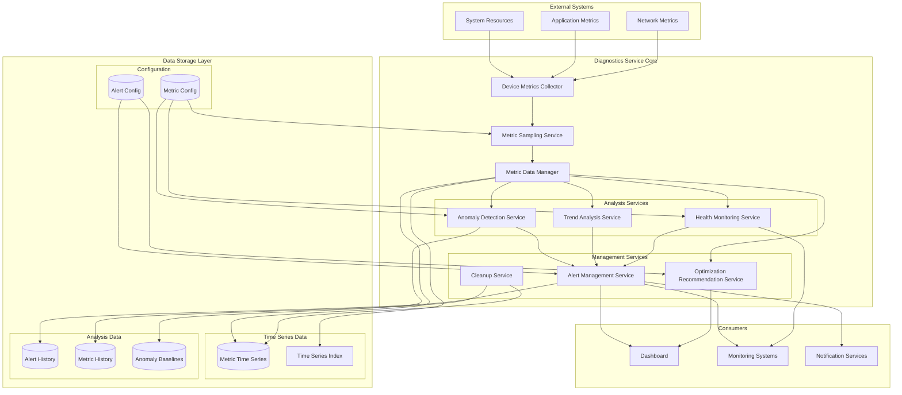
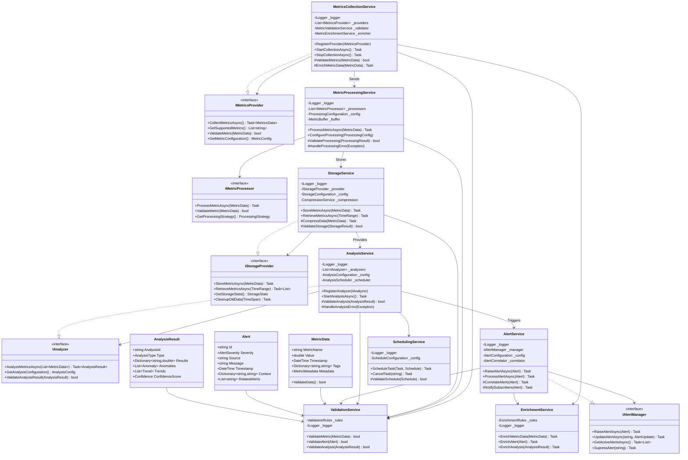
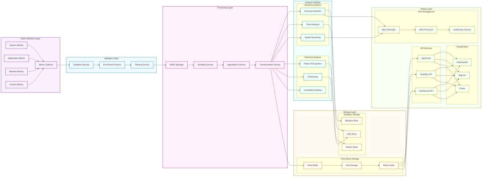
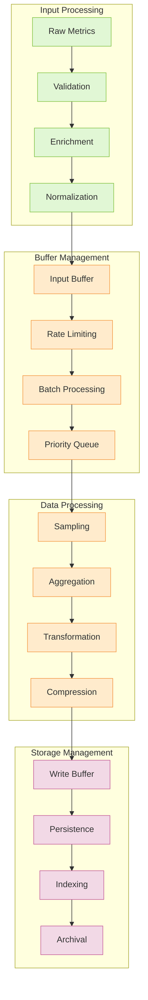
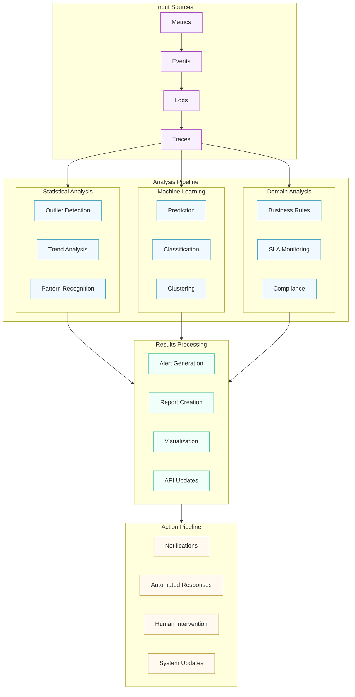
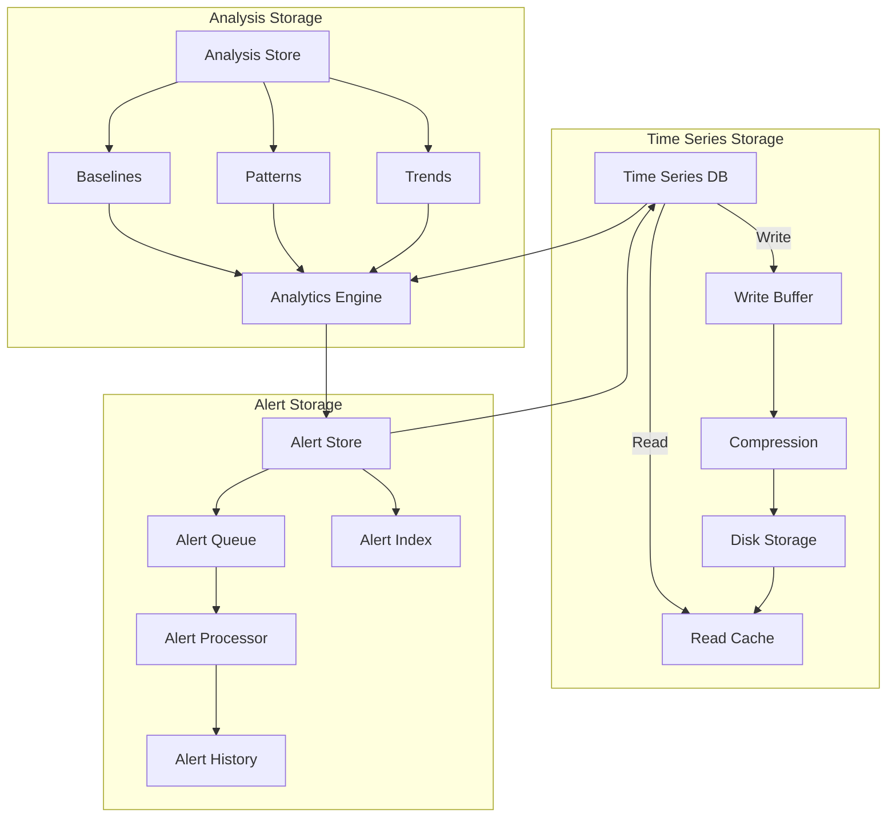
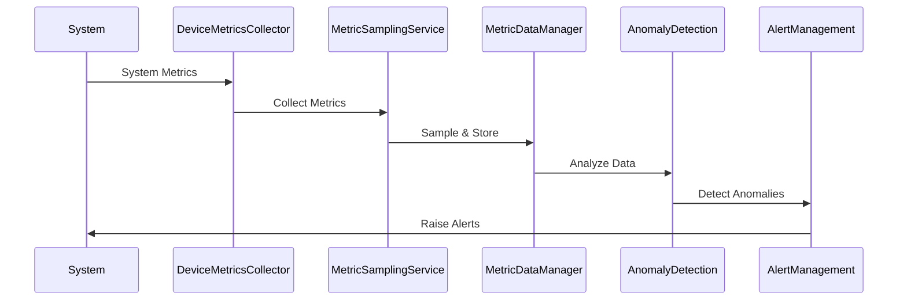
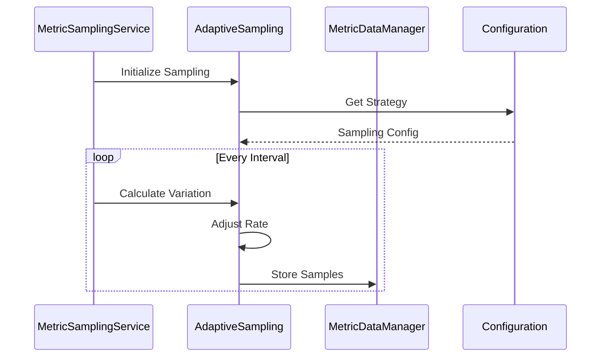

# Diagnostics Service Documentation

## Overview
The Diagnostics Service is a comprehensive monitoring and analysis system designed to collect, analyze, and manage system metrics, providing real-time insights, anomaly detection, and performance optimization recommendations.

## Architecture

### High-Level Architecture Diagram


### Detailed Component Relationships


### Data Flow Diagrams

#### Complete Data Lifecycle


#### Data Processing Pipeline


#### Analysis Pipeline


### Storage Architecture


## Sequence Diagrams

### Metric Collection and Analysis Flow


### Adaptive Sampling Process


## Core Components

### 1. Device Metrics Collector
- Collects system-level metrics
- Monitors CPU, memory, disk, and network usage
- Provides real-time health status

### 2. Metric Sampling Service
- Implements customizable sampling rates
- Supports adaptive sampling based on metric variation
- Handles downsampling for historical data

### 3. Anomaly Detection Service
- Detects statistical anomalies in metrics
- Implements multiple detection algorithms
- Provides confidence scores for detected anomalies

### 4. Health Monitoring Service
- Monitors overall system health
- Tracks resource utilization trends
- Generates health reports

### 5. Alert Management Service
- Manages alert lifecycle
- Implements alert severity levels
- Handles alert aggregation and correlation

## Configuration

### Sampling Configuration Example
```json
{
  "MetricSamplingStrategies": {
    "cpu_usage": {
      "SamplingRate": "00:00:10",
      "DownsamplingRules": [
        {
          "AgeThreshold": "01:00:00",
          "NewSamplingRate": "00:01:00"
        }
      ],
      "AdaptiveSamplingSettings": {
        "EnableAdaptiveSampling": true,
        "MinSamplingRate": "00:00:05",
        "MaxSamplingRate": "00:01:00"
      }
    }
  }
}
```

### Alert Configuration Example
```json
{
  "AlertSettings": {
    "WarningThresholds": {
      "CPU": 70,
      "Memory": 80,
      "Disk": 85
    },
    "CriticalThresholds": {
      "CPU": 90,
      "Memory": 95,
      "Disk": 95
    }
  }
}
```

## Data Models

### Metric Data Point
```csharp
public class MetricDataPoint
{
    public DateTime Timestamp { get; init; }
    public double Value { get; init; }
    public Dictionary<string, string> Tags { get; init; }
}
```

### Alert Model
```csharp
public class Alert
{
    public string Id { get; set; }
    public AlertSeverity Severity { get; set; }
    public string MetricName { get; set; }
    public string Message { get; set; }
    public DateTime Timestamp { get; set; }
}
```

## Features

### 1. Metric Collection
- Real-time system metrics monitoring
- Custom metric collection support
- Configurable collection intervals

### 2. Data Management
- Efficient time-series data storage
- Automatic data cleanup
- Data retention policies

### 3. Analysis
- Statistical anomaly detection
- Trend analysis
- Pattern recognition
- Seasonality detection

### 4. Alerting
- Multi-level alerting
- Alert correlation
- Custom alert rules
- Alert suppression

### 5. Optimization
- Resource optimization recommendations
- Performance insights
- Capacity planning support

## Best Practices

1. **Sampling Rates**
   - Use appropriate sampling rates based on metric importance
   - Enable adaptive sampling for volatile metrics
   - Implement downsampling for historical data

2. **Alert Configuration**
   - Set meaningful threshold values
   - Configure appropriate alert delays
   - Use alert correlation to reduce noise

3. **Resource Management**
   - Monitor cleanup service performance
   - Adjust retention periods based on needs
   - Configure batch sizes for cleanup operations

## Performance Considerations

1. **Memory Usage**
   - Configure appropriate retention periods
   - Use batch processing for large operations
   - Implement data compression for historical data

2. **CPU Usage**
   - Adjust sampling rates based on system load
   - Use parallel processing where appropriate
   - Implement throttling mechanisms

3. **Disk I/O**
   - Batch write operations
   - Implement efficient cleanup strategies
   - Use appropriate buffer sizes

## Troubleshooting

### Common Issues

1. **High Memory Usage**
   - Check retention periods
   - Verify cleanup service operation
   - Adjust batch sizes

2. **Missing Alerts**
   - Verify alert configuration
   - Check threshold values
   - Review alert suppression rules

3. **Performance Issues**
   - Check sampling rates
   - Verify resource usage
   - Review parallel processing settings

## API Documentation

### Device Metrics
```csharp
// Get current metrics
Task<MetricsReport> GetCurrentMetricsAsync();

// Start monitoring
Task StartMonitoringAsync();

// Stop monitoring
Task StopMonitoringAsync();
```

### Alert Management
```csharp
// Raise alert
Task RaiseAlertAsync(Alert alert);

// Get active alerts
Task<IEnumerable<Alert>> GetActiveAlertsAsync();

// Acknowledge alert
Task AcknowledgeAlertAsync(string alertId);
``` 