# Analysis Pipeline Documentation

## Overview
The Analysis Pipeline is a sophisticated system that processes various input sources through multiple analysis stages to generate actionable insights and automated responses. The pipeline is designed for real-time processing while supporting historical analysis and pattern recognition.

## Pipeline Architecture

### 1. Input Sources 🟣

#### Metrics Processing
```csharp
public interface IMetricSource
{
    Task<MetricData> CollectMetricsAsync();
    IObservable<MetricData> GetMetricStream();
    MetricMetadata GetMetricMetadata();
}
```

- **System Metrics**
  - Hardware utilization
  - Resource consumption
  - Performance counters
  - System state

- **Application Metrics**
  - Performance metrics
  - Business metrics
  - User metrics
  - Service health

#### Event Processing
```csharp
public interface IEventSource
{
    Task<EventData> CollectEventsAsync();
    IObservable<EventData> GetEventStream();
    EventMetadata GetEventMetadata();
}
```

- **System Events**
  - State changes
  - Error events
  - Security events
  - Configuration changes

- **Application Events**
  - User actions
  - Business events
  - Integration events
  - Lifecycle events

#### Log Processing
```csharp
public interface ILogSource
{
    Task<LogData> CollectLogsAsync();
    IObservable<LogData> GetLogStream();
    LogMetadata GetLogMetadata();
}
```

- **System Logs**
  - Error logs
  - Audit logs
  - Security logs
  - Performance logs

- **Application Logs**
  - Debug logs
  - Info logs
  - Warning logs
  - Error logs

#### Trace Processing
```csharp
public interface ITraceSource
{
    Task<TraceData> CollectTracesAsync();
    IObservable<TraceData> GetTraceStream();
    TraceMetadata GetTraceMetadata();
}
```

- **Distributed Traces**
  - Request traces
  - Transaction traces
  - Service traces
  - Performance traces

### 2. Analysis Types 🔵

#### Statistical Analysis
```csharp
public interface IStatisticalAnalyzer
{
    Task<OutlierResult> DetectOutliersAsync(IEnumerable<MetricData> data);
    Task<TrendResult> AnalyzeTrendsAsync(IEnumerable<MetricData> data);
    Task<PatternResult> RecognizePatternsAsync(IEnumerable<MetricData> data);
}
```

- **Outlier Detection**
  - Z-score analysis
  - IQR analysis
  - MAD analysis
  - Isolation Forest

- **Trend Analysis**
  - Moving averages
  - Exponential smoothing
  - Regression analysis
  - Seasonality detection

- **Pattern Recognition**
  - Frequency analysis
  - Sequence matching
  - Cyclic pattern detection
  - Anomaly patterns

#### Machine Learning
```csharp
public interface IMLAnalyzer
{
    Task<PredictionResult> PredictMetricsAsync(IEnumerable<MetricData> data);
    Task<ClassificationResult> ClassifyAnomaliesAsync(IEnumerable<MetricData> data);
    Task<ClusteringResult> ClusterMetricsAsync(IEnumerable<MetricData> data);
}
```

- **Prediction Models**
  - Time series forecasting
  - Resource usage prediction
  - Capacity planning
  - Trend prediction

- **Classification Models**
  - Anomaly classification
  - Error classification
  - Performance classification
  - Behavior classification

- **Clustering Models**
  - Metric clustering
  - Behavior clustering
  - Pattern clustering
  - Anomaly clustering

#### Domain Analysis
```csharp
public interface IDomainAnalyzer
{
    Task<RuleResult> EvaluateBusinessRulesAsync(MetricData data);
    Task<SLAResult> MonitorSLAAsync(MetricData data);
    Task<ComplianceResult> CheckComplianceAsync(MetricData data);
}
```

- **Business Rules**
  - KPI monitoring
  - Business metrics
  - Process rules
  - Custom rules

- **SLA Monitoring**
  - Performance SLAs
  - Availability SLAs
  - Response time SLAs
  - Error rate SLAs

- **Compliance Checks**
  - Security compliance
  - Data compliance
  - Process compliance
  - Regulatory compliance

### 3. Results Processing 💚

#### Alert Generation
```csharp
public interface IAlertGenerator
{
    Task<Alert> GenerateAlertAsync(AnalysisResult result);
    Task<AlertMetadata> EnrichAlertAsync(Alert alert);
    Task<AlertPriority> CalculatePriorityAsync(Alert alert);
}
```

- **Alert Types**
  - Critical alerts
  - Warning alerts
  - Info alerts
  - Custom alerts

#### Report Creation
```csharp
public interface IReportGenerator
{
    Task<Report> GenerateReportAsync(AnalysisResult result);
    Task<byte[]> ExportReportAsync(Report report, ExportFormat format);
    Task<ReportMetadata> GetReportMetadataAsync(Report report);
}
```

- **Report Types**
  - Performance reports
  - Trend reports
  - Compliance reports
  - Custom reports

#### Visualization
```csharp
public interface IVisualizationGenerator
{
    Task<VisualizationData> GenerateVisualizationAsync(AnalysisResult result);
    Task<InteractiveChart> CreateInteractiveChartAsync(VisualizationData data);
    Task<Dashboard> UpdateDashboardAsync(VisualizationData data);
}
```

- **Visualization Types**
  - Time series charts
  - Heat maps
  - Correlation matrices
  - Custom visualizations

#### API Updates
```csharp
public interface IAPIUpdater
{
    Task<APIResponse> UpdateAPIAsync(AnalysisResult result);
    Task<WebhookResult> TriggerWebhooksAsync(AnalysisResult result);
    Task<IntegrationResult> UpdateIntegrationsAsync(AnalysisResult result);
}
```

- **Update Types**
  - REST API updates
  - GraphQL updates
  - WebSocket updates
  - Webhook triggers

### 4. Action Pipeline 🟧

#### Notifications
```csharp
public interface INotificationManager
{
    Task<NotificationResult> SendNotificationAsync(Alert alert);
    Task<EscalationResult> HandleEscalationAsync(Alert alert);
    Task<DeliveryStatus> TrackDeliveryAsync(Notification notification);
}
```

- **Notification Types**
  - Email notifications
  - SMS notifications
  - Push notifications
  - Custom channels

#### Automated Responses
```csharp
public interface IAutomatedResponseManager
{
    Task<AutomationResult> ExecuteAutomatedResponseAsync(Alert alert);
    Task<ValidationResult> ValidateResponseAsync(AutomatedResponse response);
    Task<ExecutionStatus> TrackExecutionAsync(AutomatedResponse response);
}
```

- **Response Types**
  - Resource scaling
  - Service restart
  - Configuration updates
  - Custom actions

#### Human Intervention
```csharp
public interface IHumanInterventionManager
{
    Task<TicketResult> CreateTicketAsync(Alert alert);
    Task<EscalationResult> EscalateToTeamAsync(Alert alert);
    Task<WorkflowResult> InitiateWorkflowAsync(Alert alert);
}
```

- **Intervention Types**
  - Ticket creation
  - Team escalation
  - Manual review
  - Approval workflow

#### System Updates
```csharp
public interface ISystemUpdateManager
{
    Task<UpdateResult> ApplySystemUpdateAsync(AutomatedResponse response);
    Task<RollbackResult> HandleRollbackAsync(UpdateResult result);
    Task<ValidationResult> ValidateUpdateAsync(SystemUpdate update);
}
```

- **Update Types**
  - Configuration updates
  - Resource allocation
  - Policy updates
  - System optimization

## Color Coding Guide

| Component | Color | Hex Code | Purpose |
|-----------|-------|----------|---------|
| Input Sources | Purple | #f9f0ff | Raw data ingestion |
| Analysis Types | Blue | #f0f9ff | Data processing and analysis |
| Results Processing | Green | #f0fff9 | Insight generation |
| Action Pipeline | Orange | #fff9f0 | Response execution |

## Pipeline Flow

```mermaid
graph TD
    %% Styling
    classDef input fill:#f9f0ff,stroke:#9f3fbf,stroke-width:2px
    classDef analysis fill:#f0f9ff,stroke:#3f9fbf,stroke-width:2px
    classDef results fill:#f0fff9,stroke:#3fbf9f,stroke-width:2px
    classDef actions fill:#fff9f0,stroke:#bf9f3f,stroke-width:2px

    %% Input Sources
    subgraph Input [Input Sources 🟣]
        M[Metrics]
        E[Events]
        L[Logs]
        T[Traces]
        
        M --> E
        E --> L
        L --> T
    end

    %% Analysis Types
    subgraph Analysis [Analysis Pipeline 🔵]
        subgraph Statistical [Statistical Analysis]
            SA1[Outlier Detection]
            SA2[Trend Analysis]
            SA3[Pattern Recognition]
        end

        subgraph ML [Machine Learning]
            ML1[Prediction]
            ML2[Classification]
            ML3[Clustering]
        end

        subgraph Domain [Domain Analysis]
            D1[Business Rules]
            D2[SLA Monitoring]
            D3[Compliance]
        end

        %% Analysis Flow
        SA1 & SA2 & SA3 --> ML1 & ML2 & ML3
        ML1 & ML2 & ML3 --> D1 & D2 & D3
    end

    %% Results Processing
    subgraph Results [Results Processing 💚]
        R1[Alert Generation]
        R2[Report Creation]
        R3[Visualization]
        R4[API Updates]

        %% Results Flow
        R1 --> R2
        R2 --> R3
        R3 --> R4
    end

    %% Action Pipeline
    subgraph Actions [Action Pipeline 🟧]
        A1[Notifications]
        A2[Automated Responses]
        A3[Human Intervention]
        A4[System Updates]

        %% Action Flow
        A1 --> A2
        A2 --> A3
        A3 --> A4
    end

    %% Main Flow Connections
    T --> Statistical
    D3 --> R1
    R4 --> A1

    %% Styling
    class Input input
    class Analysis analysis
    class Results results
    class Actions actions
```


## Key Features

### 1. Clear Data Flow Paths
- **Sequential Processing**
  - Metrics → Events → Logs → Traces
  - Raw Data → Analysis → Results → Actions
- **Parallel Processing**
  - Multiple analysis types running concurrently
  - Independent processing streams for different data types
- **Feedback Loops**
  - Analysis results feeding back into data collection
  - Action outcomes updating analysis parameters

### 2. Logical Component Grouping
- **Input Layer**
  - Grouped by data type and source
  - Clear separation of system and application data
  - Standardized collection interfaces
- **Analysis Layer**
  - Organized by analysis methodology
  - Clear separation of concerns
  - Modular and extensible design

### 3. Color-Coded Architecture
- **Purple (Input) 🟣**
  - Raw data ingestion
  - Initial processing
  - Data validation
- **Blue (Analysis) 🔵**
  - Data processing
  - Pattern detection
  - Insight generation
- **Green (Results) 💚**
  - Output generation
  - Result formatting
  - Distribution preparation
- **Orange (Actions) 🟧**
  - Response execution
  - System updates
  - User notifications

### 4. Processing Stages
- **Data Collection**
  - Multi-source ingestion
  - Real-time streaming
  - Batch processing
- **Analysis Pipeline**
  - Multi-level analysis
  - Parallel processing
  - Cross-correlation
- **Results Generation**
  - Multiple output formats
  - Priority-based processing
  - Customizable reporting
- **Action Execution**
  - Automated responses
  - Manual interventions
  - System optimizations

### 5. Comprehensive Analysis
- **Statistical Analysis**
  - Real-time outlier detection
  - Trend analysis with forecasting
  - Pattern recognition
- **Machine Learning**
  - Predictive analytics
  - Anomaly classification
  - Behavioral clustering
- **Domain Analysis**
  - Business rule evaluation
  - SLA compliance monitoring
  - Regulatory checks

### 6. Multiple Output Channels
- **Alerts and Notifications**
  - Priority-based alerting
  - Multi-channel delivery
  - Escalation paths
- **Reports and Visualizations**
  - Interactive dashboards
  - Custom report generation
  - Real-time updates
- **API and Integration**
  - REST/GraphQL APIs
  - Webhook triggers
  - Third-party integration

### 7. Component Relationships
- **Horizontal Integration**
  - Cross-component communication
  - Shared data models
  - Standardized interfaces
- **Vertical Integration**
  - Layer-specific processing
  - Clear responsibility boundaries
  - Efficient data flow

## Best Practices

### 1. Input Processing
- Validate input data quality
- Handle missing data gracefully
- Implement data buffering
- Monitor input latency

### 2. Analysis Execution
- Use appropriate algorithms
- Implement timeout handling
- Cache analysis results
- Monitor analysis performance

### 3. Result Generation
- Prioritize critical results
- Implement result caching
- Handle result delivery failures
- Monitor result quality

### 4. Action Execution
- Validate actions before execution
- Implement rollback mechanisms
- Monitor action effectiveness
- Track action completion 