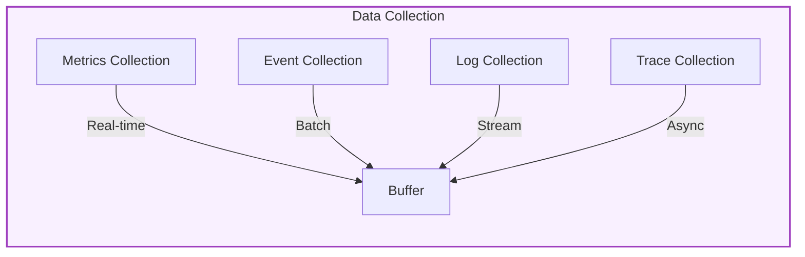
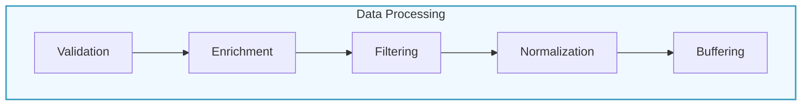
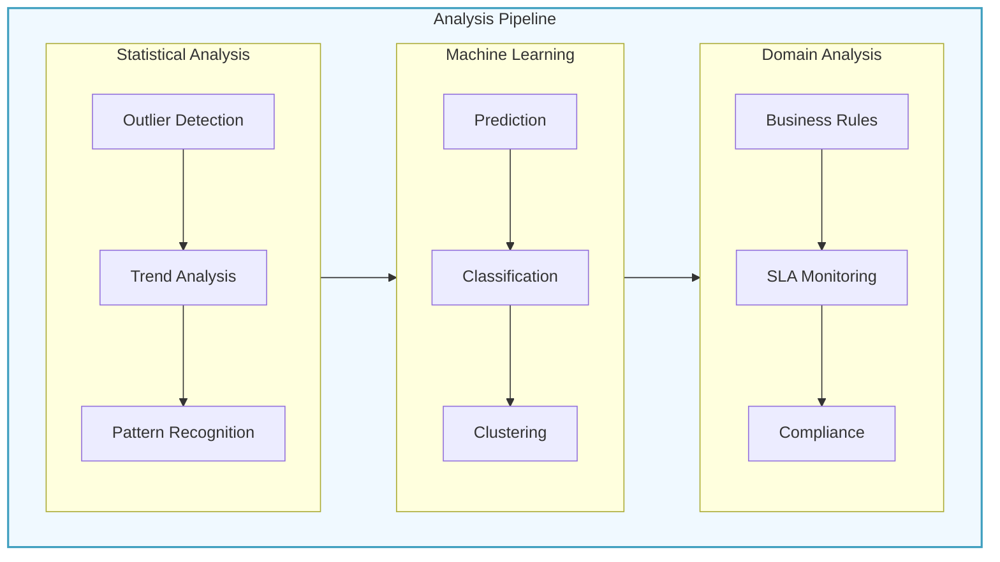
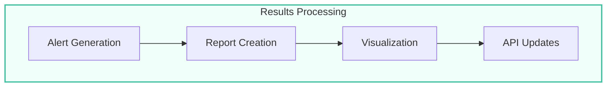
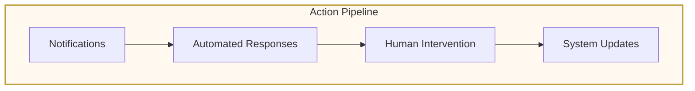
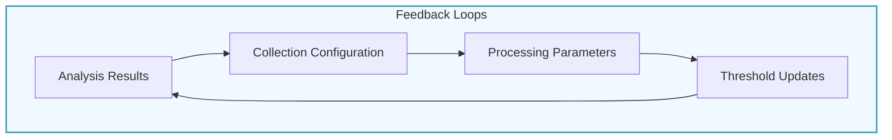

# Data Flow Documentation

## Overview
This document describes how data flows through the Analysis Pipeline system, from initial collection to final action execution. The system is designed for efficient data processing with clear pathways, parallel processing capabilities, and feedback mechanisms.

## Data Flow Stages

### 1. Data Ingestion Stage 🟣

#### Input Collection

- **Metrics Flow**
  - System metrics (CPU, Memory, Disk)
  - Application metrics (Response times, Error rates)
  - Custom metrics (Business KPIs)
  - Collection frequency: 1-60 seconds

- **Events Flow**
  - System events (State changes, Errors)
  - Application events (User actions, Integration)
  - Security events (Access, Violations)
  - Collection mode: Event-driven

- **Logs Flow**
  - System logs (Error, Security, Audit)
  - Application logs (Debug, Info, Warning)
  - Performance logs (Timing, Resources)
  - Collection mode: Stream-based

- **Traces Flow**
  - Request traces (API calls, Transactions)
  - Distributed traces (Service calls)
  - Performance traces (Execution paths)
  - Collection mode: Asynchronous

### 2. Data Processing Stage 🔵

#### Pre-processing Pipeline

- **Data Validation**
  - Schema validation
  - Type checking
  - Range validation
  - Consistency checks

- **Data Enrichment**
  - Timestamp normalization
  - Context addition
  - Metadata augmentation
  - Tag enrichment

- **Data Filtering**
  - Noise reduction
  - Duplicate removal
  - Relevance filtering
  - Rate limiting

### 3. Analysis Stage 🔵

#### Analysis Pipeline

- **Statistical Analysis Flow**
  1. Raw data ingestion
  2. Statistical computation
  3. Pattern detection
  4. Anomaly identification

- **Machine Learning Flow**
  1. Feature extraction
  2. Model application
  3. Prediction generation
  4. Classification/Clustering

- **Domain Analysis Flow**
  1. Rule evaluation
  2. SLA checking
  3. Compliance verification
  4. Business logic application

### 4. Results Generation Stage 💚

#### Results Pipeline

- **Alert Generation Flow**
  1. Condition evaluation
  2. Priority calculation
  3. Alert enrichment
  4. Distribution preparation

- **Report Generation Flow**
  1. Data aggregation
  2. Format selection
  3. Report composition
  4. Delivery preparation

- **Visualization Flow**
  1. Data transformation
  2. Chart generation
  3. Dashboard updates
  4. Interactive elements

### 5. Action Execution Stage 🟧

#### Action Pipeline

- **Notification Flow**
  1. Channel selection
  2. Message preparation
  3. Delivery execution
  4. Status tracking

- **Response Flow**
  1. Action determination
  2. Validation
  3. Execution
  4. Result monitoring

- **Update Flow**
  1. Change preparation
  2. Validation
  3. Application
  4. Verification

## Data Flow Patterns

### 1. Sequential Processing
- Linear flow through stages
- Ordered execution
- Dependencies handling
- State management

### 2. Parallel Processing
- Concurrent analysis
- Independent streams
- Load balancing
- Resource optimization

### 3. Feedback Loops

- **Analysis to Collection**
  - Dynamic sampling rates
  - Collection frequency adjustment
  - Priority updates
  - Resource allocation

- **Results to Analysis**
  - Threshold adjustments
  - Model updates
  - Rule refinements
  - Pattern learning

- **Actions to Configuration**
  - System optimization
  - Resource reallocation
  - Policy updates
  - Performance tuning

## Performance Considerations

### 1. Buffering and Batching
- Input buffering
- Batch processing
- Queue management
- Memory optimization

### 2. Throughput Management
- Rate limiting
- Load balancing
- Resource allocation
- Scaling policies

### 3. Latency Optimization
- Processing prioritization
- Cache utilization
- Parallel execution
- Resource efficiency

## Error Handling

### 1. Data Quality Issues
- Validation failures
- Missing data
- Corrupt data
- Format issues

### 2. Processing Errors
- Analysis failures
- Resource constraints
- Timeout issues
- System errors

### 3. Recovery Mechanisms
- Retry logic
- Fallback options
- Error escalation
- Data recovery

## Monitoring and Maintenance

### 1. Performance Monitoring
- Throughput tracking
- Latency measurement
- Resource utilization
- Queue depths

### 2. Health Checks
- Component status
- System health
- Resource availability
- Error rates

### 3. Maintenance Tasks
- Data cleanup
- Cache management
- Resource optimization
- System updates 