# Data Flow Stages Documentation

## Overview
The system's data flow is organized into five distinct stages, each color-coded for clarity and easy identification. Each stage has specific responsibilities and interfaces with adjacent stages through well-defined protocols.

## Complete Data Flow Diagram

### Enhanced Flow Diagram

```mermaid
graph LR
    %% Style Definitions with Thicker Borders and Enhanced Visibility
    classDef ingestion fill:#f9f0ff,stroke:#9f3fbf,stroke-width:4px,font-weight:bold
    classDef processing fill:#f0f9ff,stroke:#3f9fbf,stroke-width:4px,font-weight:bold
    classDef analysis fill:#f0f9ff,stroke:#3f9fbf,stroke-width:4px,font-weight:bold
    classDef results fill:#f0fff9,stroke:#3fbf9f,stroke-width:4px,font-weight:bold
    classDef actions fill:#fff9f0,stroke:#bf9f3f,stroke-width:4px,font-weight:bold

    %% Main System Data Flow with Enhanced Labels
    subgraph System_Flow [System Data Flow Pipeline]
        %% Stage Definitions with Detailed Labels
        I[Data Ingestion 🟣<br/><hr/>Collection & Buffering<br/>Source Management] -->|Raw Data<br/>Streams| P[Data Processing 🔵<br/><hr/>Validation & Enrichment<br/>Quality Control]
        P -->|Clean Data<br/>Structured| A[Analysis 🔵<br/><hr/>ML & Statistics<br/>Pattern Detection]
        A -->|Insights<br/>Patterns| R[Results 💚<br/><hr/>Alerts & Reports<br/>Visualizations]
        R -->|Triggers<br/>Actions| AC[Actions 🟧<br/><hr/>Responses & Updates<br/>Interventions]
    end

    %% Primary Feedback Loops with Detailed Labels
    AC -.->|System Configuration<br/>Updates & Optimization| I
    R -.->|Analysis Feedback<br/>Model Tuning| A
    A -.->|Processing Rules<br/>Quality Parameters| P

    %% Cross-Stage Feedback with Enhanced Description
    AC -.->|Performance Optimization<br/>Resource Management| P
    R -.->|Collection Thresholds<br/>Sampling Rates| I
    A -.->|Data Requirements<br/>Collection Adjustments| I

    %% Stage Classifications with Enhanced Styling
    class I ingestion
    class P processing
    class A analysis
    class R results
    class AC actions

    %% Stage Descriptions
    style System_Flow fill:#f5f5f5,stroke:#333,stroke-width:2px
```

### High-Level Flow Characteristics

#### Stage Purposes
1. **Data Ingestion (🟣)**
   - Collects data from multiple sources
   - Buffers incoming data streams
   - Manages collection rates
   - Handles data prioritization

2. **Data Processing (🔵)**
   - Validates incoming data
   - Enriches with context
   - Filters irrelevant data
   - Normalizes formats

3. **Analysis (🔵)**
   - Performs statistical analysis
   - Applies machine learning
   - Evaluates domain rules
   - Detects patterns

4. **Results (💚)**
   - Generates alerts
   - Creates reports
   - Updates visualizations
   - Manages API responses

5. **Actions (🟧)**
   - Sends notifications
   - Executes automated responses
   - Manages interventions
   - Updates system configuration

#### Flow Relationships

1. **Primary Data Flow**
   - Raw Data → Clean Data → Insights → Actions
   - Sequential processing pipeline
   - Data transformation at each stage
   - Progressive refinement

2. **Primary Feedback Loops**
   - Actions → Ingestion (Configuration Updates)
   - Results → Analysis (Analysis Feedback)
   - Analysis → Processing (Processing Rules)

3. **Secondary Feedback Loops**
   - Actions → Processing (System Optimization)
   - Results → Ingestion (Threshold Updates)
   - Analysis → Ingestion (Collection Adjustments)

#### Color Coding Purpose

1. **Purple (🟣) - Ingestion**
   - Raw data handling
   - Initial buffering
   - Collection management
   - Source integration

2. **Blue (🔵) - Processing & Analysis**
   - Data transformation
   - Quality control
   - Pattern detection
   - Insight generation

3. **Green (💚) - Results**
   - Output generation
   - Insight presentation
   - Communication
   - Distribution

4. **Orange (🟧) - Actions**
   - Response execution
   - System adaptation
   - Intervention management
   - Configuration control

### Detailed Component Flow

```mermaid
graph TD
    classDef ingestion fill:#f9f0ff,stroke:#9f3fbf,stroke-width:2px
    classDef processing fill:#f0f9ff,stroke:#3f9fbf,stroke-width:2px
    classDef analysis fill:#f0f9ff,stroke:#3f9fbf,stroke-width:2px
    classDef results fill:#f0fff9,stroke:#3fbf9f,stroke-width:2px
    classDef actions fill:#fff9f0,stroke:#bf9f3f,stroke-width:2px

    %% Data Ingestion Stage
    subgraph Ingestion [1. Data Ingestion 🟣]
        M[Metrics] --> B[Buffer]
        E[Events] --> B
        L[Logs] --> B
        T[Traces] --> B
        B --> Q[Queue]
    end

    %% Data Processing Stage
    subgraph Processing [2. Data Processing 🔵]
        V[Validation] --> EN[Enrichment]
        EN --> F[Filtering]
        F --> N[Normalization]
    end

    %% Analysis Stage
    subgraph Analysis [3. Analysis 🔵]
        SA[Statistical Analysis]
        ML[Machine Learning]
        DA[Domain Analysis]
        
        SA --> ML
        ML --> DA
    end

    %% Results Stage
    subgraph Results [4. Results 💚]
        AG[Alert Generation]
        RG[Report Generation]
        VZ[Visualization]
        API[API Updates]
        
        AG --> RG
        RG --> VZ
        VZ --> API
    end

    %% Action Stage
    subgraph Actions [5. Actions 🟧]
        N[Notifications]
        AR[Automated Responses]
        HI[Human Intervention]
        SU[System Updates]
        
        N --> AR
        AR --> HI
        HI --> SU
    end

    %% Inter-stage Connections
    Q --> V
    N --> SA
    DA --> AG
    API --> N

    %% Feedback Loops
    SU -.-> |System Configuration| M
    VZ -.-> |Analysis Feedback| ML
    AR -.-> |Processing Rules| F

    class Ingestion ingestion
    class Processing processing
    class Analysis analysis
    class Results results
    class Actions actions
```

### Stage Relationships Matrix

### Data Flow Characteristics

#### Stage Transitions
- **Ingestion → Processing**
  - Raw data buffering
  - Batch aggregation
  - Priority queuing
  - Rate limiting

- **Processing → Analysis**
  - Clean data streaming
  - Context preservation
  - Metadata enrichment
  - Schema validation

- **Analysis → Results**
  - Insight generation
  - Pattern detection
  - Anomaly identification
  - Trend analysis

- **Results → Actions**
  - Alert triggering
  - Report distribution
  - Visualization updates
  - API notifications

#### Feedback Mechanisms
- **Actions → Ingestion**
  - Collection frequency
  - Sampling rates
  - Priority levels
  - Resource allocation

- **Results → Analysis**
  - Model updates
  - Threshold adjustments
  - Pattern refinement
  - Rule modifications

- **Analysis → Processing**
  - Filter criteria
  - Enrichment rules
  - Validation parameters
  - Normalization settings

## 1. Data Ingestion Stage 🟣

### Purpose
Primary entry point for all system data, handling multiple data types and collection methods.

### Components

### Key Features
- **Multi-source Collection**
  - Real-time metrics (1-60s intervals)
  - Event-driven collection
  - Stream-based logging
  - Distributed tracing

- **Data Buffering**
  - Memory-efficient buffering
  - Overflow protection
  - Priority queuing
  - Back-pressure handling

## 2. Data Processing Stage 🔵

### Purpose
Transforms raw data into a standardized format while ensuring quality and relevance.

### Components

### Key Features
- **Data Quality**
  - Schema validation
  - Type checking
  - Range validation
  - Consistency verification

- **Enhancement**
  - Context enrichment
  - Metadata addition
  - Relationship mapping
  - Tag management

## 3. Analysis Stage 🔵

### Purpose
Performs multi-level analysis to extract insights and patterns from processed data.

### Components

### Key Features
- **Analysis Types**
  - Statistical analysis
  - Machine learning
  - Domain-specific rules
  - Pattern recognition

- **Processing Modes**
  - Real-time analysis
  - Batch processing
  - Predictive analysis
  - Trend detection

## 4. Results Generation Stage 💚

### Purpose
Transforms analysis outputs into actionable insights and visualizations.

### Components

### Key Features
- **Output Types**
  - Alert generation
  - Report creation
  - Visualization
  - API updates

- **Delivery Methods**
  - Real-time notifications
  - Scheduled reports
  - Interactive dashboards
  - API endpoints

## 5. Action Execution Stage 🟧

### Purpose
Executes responses based on analysis results and system policies.

### Components

### Key Features
- **Action Types**
  - Automated responses
  - Manual interventions
  - System updates
  - Policy enforcement

- **Execution Controls**
  - Validation checks
  - Rollback capability
  - Audit logging
  - Status tracking

## Stage Integration

### Data Flow Control

### Key Integration Points
1. **Stage Transitions**
   - Buffer management
   - Queue handling
   - Rate limiting
   - Flow control

2. **Data Transformation**
   - Format conversion
   - Protocol adaptation
   - Schema mapping
   - State tracking

3. **Error Handling**
   - Error detection
   - Recovery procedures
   - Fallback mechanisms
   - Error reporting

## Performance Optimization

### Stage-specific Optimization
1. **Ingestion Optimization**
   - Batch collection
   - Compression
   - Priority queuing
   - Load balancing

2. **Processing Optimization**
   - Parallel processing
   - Cache utilization
   - Resource pooling
   - Memory management

3. **Analysis Optimization**
   - Algorithm selection
   - Resource allocation
   - Cache strategy
   - Workload distribution

4. **Results Optimization**
   - Output buffering
   - Format optimization
   - Delivery scheduling
   - Resource efficiency

5. **Action Optimization**
   - Execution planning
   - Resource management
   - Priority handling
   - Response timing 